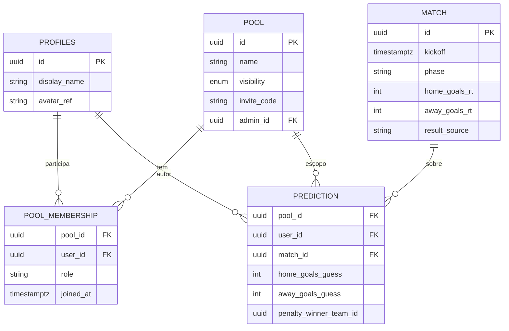

# Engenharia de software aplicada ao projeto BigBall

**Tipo de documento:** artefato acadêmico complementar ao Trabalho de Conclusão de Curso (TCC)  
**Base normativa:** [PRD.md](./PRD.md) (produto e regras de negócio), [TechSpec.md](./TechSpec.md) (stack, integrações e decisões de implementação)  
**Versão:** 1.0  
**Data:** 7 de maio de 2026

---

## Resumo

Este documento formaliza três frentes clássicas de engenharia de software para o sistema **BigBall**: identificação de _stakeholders_, especificação estruturada de requisitos e modelo de dados de alto nível. O BigBall é um _hub_ digital para criação, participação e acompanhamento de bolões da Copa do Mundo FIFA 2026, com autenticação, bolões públicos ou privados, palpites, pontuação determinística e ranking. Detalhes de produto permanecem no PRD; detalhes de implementação, no Tech Spec.

**Palavras-chave:** engenharia de software; _stakeholders_; especificação de requisitos; modelo de dados; bolão; aplicação web.

---

## 1. Introdução

Projetos de software destinados tanto ao uso real quanto à avaliação acadêmica beneficiam de documentação que explicite **quem** é impactado pelo sistema (**stakeholders**), **o que** o sistema deve fazer (**requisitos**) e **como** a informação se organiza (**modelo de dados**). O presente texto não substitui o PRD nem o Tech Spec: consolida e reorganiza informações já acordadas nesses documentos para fins de formalização no contexto do TCC.

---

## 2. Identificação de _stakeholders_

Em engenharia de software, _stakeholder_ é qualquer indivíduo, grupo ou organização que afeta ou é afetado pelo sistema. A tabela a seguir classifica os _stakeholders_ do BigBall quanto ao papel e à principal expectativa em relação ao produto.

| _Stakeholder_                                                          | Categoria            | Interesse e expectativa principal                                                                                                                                                                                         |
| ---------------------------------------------------------------------- | -------------------- | ------------------------------------------------------------------------------------------------------------------------------------------------------------------------------------------------------------------------- |
| **Usuário final — organizador de bolão**                               | Primário             | Criar bolão (público ou privado), definir premiação e informações visíveis, convidar participantes, acompanhar membros, prazos de palpite e ranking.                                                                      |
| **Usuário final — participante casual**                                | Primário             | Entrar em bolões com poucos passos, palpitar dentro dos prazos, ver calendário, resultados e posição no ranking.                                                                                                          |
| **Usuário final — participante engajado**                              | Primário             | Acompanhar classificação, histórico de pontos e, no roadmap, funcionalidades adicionais (ex.: simulação, placar ao vivo).                                                                                                 |
| **Administrador de bolão** (_intra_ produto)                           | Primário operacional | Mesmo ator que o organizador em muitos fluxos; papel explícito na governança do bolão (ex.: edição de premiação, condução de sorteio em desempates conforme regras do PRD).                                               |
| **Administrador de plataforma**                                        | Primário operacional | Garantir integridade global dos resultados de partidas quando o provedor de dados falhar ou for insuficiente; inserir ou corrigir resultado manual **global**, com auditoria e precedência do feed quando este atualizar. |
| **Instituição de ensino / banca / orientação**                         | Secundário           | Avaliar rigor metodológico, clareza de requisitos e adequação do escopo ao TCC.                                                                                                                                           |
| **Provedor de identidade e dados (ex.: Supabase Auth, API esportiva)** | Secundário técnico   | Disponibilizar serviços contratados (autenticação, armazenamento, dados de partidas); políticas de uso, quotas e SLAs impactam o produto.                                                                                 |
| **Equipe de desenvolvimento / manutenção**                             | Secundário           | Implementar, testar, operar e evoluir o sistema conforme PRD e Tech Spec.                                                                                                                                                 |
| **Regulador / compliance (futuro)**                                    | Terciário / roadmap  | Integrações com apostas ou pagamentos exigiriam análise jurídica; no MVP, pagamentos reais e apostas reguladas estão fora de escopo.                                                                                      |

As **personas** descritas no PRD (organizador, participante casual, participante engajado) correspondem aos _stakeholders_ primários de uso. Os perfis **administrador de bolão** e **administrador de plataforma** são distintos: o primeiro governa um bolão específico; o segundo atua sobre dados de partidas que afetam **todos** os bolões, evitando conflitos de placar entre grupos.

---

## 3. Especificação de requisitos

A especificação abaixo organiza requisitos **funcionais** (RF) e **não funcionais** (RNF), alinhados ao PRD. Critérios de aceite detalhados permanecem no PRD; aqui prioriza-se rastreabilidade e cobertura para documentação acadêmica.

### 3.1 Requisitos funcionais — MVP

| ID    | Requisito                                                                                                                                                                                                                                                                                                                                           | Origem (PRD) |
| ----- | --------------------------------------------------------------------------------------------------------------------------------------------------------------------------------------------------------------------------------------------------------------------------------------------------------------------------------------------------- | ------------ |
| RF-01 | O sistema deve permitir **cadastro e autenticação** (e-mail e senha, com política mínima de senha; **Google OAuth**), **sessão segura**, **logout** que invalide sessão no cliente e no servidor (ou revogação de _refresh token_, conforme arquitetura) e **recuperação de senha** com link temporário.                                            | §4.1         |
| RF-02 | O sistema deve manter **perfil mínimo** (nome de exibição, avatar) editável após login, exibido no ranking e na lista de membros do bolão.                                                                                                                                                                                                          | §4.2         |
| RF-03 | Usuário autenticado deve **criar bolão** com nome, descrição opcional, tipo (público ou privado), premiação (texto obrigatório) e custo de entrada opcional (informativo no MVP). Bolão privado deve gerar **código de convite**; o criador torna-se **admin** do bolão.                                                                            | §4.3         |
| RF-04 | Usuário autenticado deve **entrar** em bolão público (fluxo explícito de participação) ou privado (código válido); não permitir dupla filiação ao mesmo bolão; permitir saída conforme regras do bolão.                                                                                                                                             | §4.4         |
| RF-05 | O sistema deve exibir **calendário de jogos** da Copa 2026 (fase de grupos e mata-mata), com data/hora, seleções, fase e estádio quando disponível, agrupamento navegável (por data ou fase) e tratamento compreensível de **fuso horário**.                                                                                                        | §4.5         |
| RF-06 | Para partidas encerradas, o sistema deve exibir **placar oficial** usado no cálculo, com **bloqueio de novos palpites** após encerramento; a **fonte vigente** do resultado deve refletir provedor ou entrada manual global, com **precedência do provedor** quando atualizar, **recálculo idempotente** e **rastreabilidade** (origem, auditoria). | §4.6, §4.11  |
| RF-07 | O sistema deve aceitar **palpites** (placar mandante × visitante) até o **lock** no **início oficial** da partida; permitir **alteração** até o lock; após lock, somente leitura. No **mata-mata**, o palpite deve incluir **vencedor hipotético na disputa de pênaltis** (obrigatório na UI).                                                      | §4.7         |
| RF-08 | A **elegibilidade** para palpitar em uma partida exige que o jogo ainda não tenha iniciado na submissão; membro que **entra no bolão após o início** de uma partida **não** palpita essa partida naquele bolão.                                                                                                                                     | §4.7         |
| RF-09 | O sistema deve calcular **pontos por partida** de forma **determinística** conforme faixas (20, 16, 15, 10, 5, 0) sobre o **tempo regulamentar** e **bônus +3** por acerto na disputa de pênaltis quando aplicável; partidas sem palpite válido contribuem com **0** pontos.                                                                        | §4.8         |
| RF-10 | O **ranking** do bolão deve ser a **soma** dos pontos por partida, ordenado por total decrescente, aplicando a **cadeia de desempate** (contagens por faixa, depois bônus +3, depois sorteio 1.._n_ com **participante neutro** e **auditoria obrigatória**).                                                                                       | §4.8, §4.10  |
| RF-11 | O sistema deve exibir **premiação** e **custo de entrada** (quando houver) de forma visível; admin do bolão pode editar premiação (MVP).                                                                                                                                                                                                            | §4.9         |
| RF-12 | A página do bolão deve listar **membros**, **ranking** e permitir ao membro ver **seus palpites e pontos** por jogo (mínimo).                                                                                                                                                                                                                       | §4.10        |
| RF-13 | **Somente administrador de plataforma** pode inserir ou corrigir **resultado manual global**, com confirmação, auditoria e indicador na UI quando o resultado for manual _vs._ provedor. **Criadores e membros de bolão** não alteram placar de partida no MVP.                                                                                     | §4.11        |

### 3.2 Requisitos funcionais — _roadmap_ (pós-MVP)

| ID     | Requisito                                                                           | Origem (PRD) |
| ------ | ----------------------------------------------------------------------------------- | ------------ |
| RF-R01 | **Simulador** de resultados hipotéticos para projeção de classificação/pontuação.   | §5.1         |
| RF-R02 | **Placar ao vivo**, dependente de provedor em tempo real, custo e confiabilidade.   | §5.2         |
| RF-R03 | **Integração com apostas** (opcional), com forte exigência de **compliance** legal. | §5.3         |

### 3.3 Requisitos não funcionais

| ID     | Requisito                                                                                                                                                                            | Origem                    |
| ------ | ------------------------------------------------------------------------------------------------------------------------------------------------------------------------------------ | ------------------------- |
| RNF-01 | **Segurança:** HTTPS; credenciais geridas pelo provedor de autenticação; _rate limiting_ em login; validação de entrada (detalhes no Tech Spec).                                     | PRD §10                   |
| RNF-02 | **Privacidade:** alinhamento a LGPD/GDPR; _roadmap_ mínimo de exportação/exclusão de conta.                                                                                          | PRD §10                   |
| RNF-03 | **Performance:** listagens principais responsivas em rede móvel típica; cache de calendário quando aplicável.                                                                        | PRD §10                   |
| RNF-04 | **Uso do provedor esportivo:** minimizar chamadas HTTP compatíveis com resultado correto e com a pontuação; orçamento e cadência **configuráveis** (Tech Spec §6.2.5).               | PRD §10; Tech Spec §6.2.5 |
| RNF-05 | **Disponibilidade:** meta de _uptime_ elevada na janela da Copa; comunicação de incidentes.                                                                                          | PRD §10                   |
| RNF-06 | **Acessibilidade (web):** práticas WCAG de forma progressiva no MVP.                                                                                                                 | PRD §10                   |
| RNF-07 | **Arquitetura:** _backend_ único (API .NET) como fonte de verdade para regras sensíveis; clientes não expõem chaves do provedor de dados nem _service role_ do Supabase (Tech Spec). | Tech Spec §§2, 4, 5       |

### 3.4 Regras de negócio destacadas (consistência do domínio)

As seguintes regras, embora já refletidas nos RF acima, são frequentemente exigidas em especificações acadêmicas como **invariantes** ou **restrições de domínio**:

- **Lock de palpite:** instante do início oficial da partida (PRD §4.7).
- **Referência para faixas 1–5:** placar ao fim do **tempo regulamentar** (PRD §4.8); bônus de pênaltis é **aditivo** e só vale com disputa real de pênaltis.
- **Precedência de dados:** provedor de dados **substitui** resultado manual quando atualizar dados inequívocos; recálculo idempotente (PRD §§4.6, 4.11).
- **Desempate no ranking:** ordem fixa de critérios até sorteio auditado com participante neutro (PRD §4.8).

---

## 4. Modelo de dados

Esta seção apresenta o **modelo conceitual** do domínio, coerente com o PRD §8 e com complementos de persistência descritos no Tech Spec (ex.: auditoria de desempate).

### 4.1 Visão geral das entidades

| Entidade                                 | Descrição conceitual                                                                                                                                                                                                                                             |
| ---------------------------------------- | ---------------------------------------------------------------------------------------------------------------------------------------------------------------------------------------------------------------------------------------------------------------- |
| **Identidade (`auth.users`)**            | Conta de autenticação gerida pelo Supabase; fonte única de identidade (e-mail, _providers_ OAuth, identificadores).                                                                                                                                              |
| **Perfil (`profiles`)**                  | Dados de produto 1:1 com o usuário (`id` = `auth.users.id`): nome de exibição, avatar, e mecanismo de **papéis** (ex.: administrador de plataforma _vs._ usuário comum), conforme decisão de implementação no Tech Spec.                                         |
| **Bolão (`Pool`)**                       | Grupo de competição: nome, tipo (público/privado), código de convite (privado), referência ao admin, premiação, custo opcional, _timestamps_.                                                                                                                    |
| **Filiação ao bolão (`PoolMembership`)** | Associação usuário–bolão com papel (admin/membro) e **data/hora de entrada**, usada na **elegibilidade** de palpites por partida.                                                                                                                                |
| **Partida (`Match`)**                    | Seleções, fase, instante de início, estado, placar de referência em TR, indicadores de prorrogação/pênaltis e vencedor na disputa de pênaltis quando aplicável, **origem vigente** do resultado (provedor _vs._ manual), metadados de auditoria e substituições. |
| **Palpite (`Prediction`)**               | Para cada terno (usuário, bolão, partida): placar palpitado, vencedor nos pênaltis (mata-mata), instante de _lock_ efetivo. Cardinalidade: no máximo **um** palpite por terno.                                                                                   |
| **Pontos por partida**                   | Valor derivado ou materializado: pontos atribuídos ao par (usuário, bolão, partida) após resultado válido; decisão de persistência é de engenharia (PRD §8; Tech Spec §7).                                                                                       |

### 4.2 Relacionamentos principais

- Um **usuário** (via `profiles`) participa de **vários** bolões através de `PoolMembership`; cada bolão possui **vários** membros.
- Cada **bolão** possui exatamente um conjunto de **palpites** por membro e por partida do escopo do produto, respeitando elegibilidade e unicidade.
- **Partidas** são entidades globais ao produto; **palpites** e **pontos** são **escopados ao bolão**.
- **Atualização de `Match`:** principalmente por **jobs** que consomem o provedor externo; **correção manual global** apenas por administrador de plataforma, com trilha de auditoria e reconciliação quando o feed atualizar.

### 4.3 Extensões de auditoria (desempate)

O Tech Spec §7 sugere persistência para o **sorteio** em desempates do ranking, por exemplo (nomes ajustáveis ao _schema_): entidades ou tabelas para **rodada de desempate**, **atribuição número ↔ usuário** e **registro do sorteio** (instante, condutor, valor sorteado, posição no ranking). Isso materializa a exigência de **auditoria obrigatória** do PRD §4.8.

### 4.4 Diagrama conceitual simplificado

> **Nota:** Atributos e tipos exatos seguem o _schema_ versionado no repositório (migrations); o diagrama ilustra **relações conceituais**, não substitui o dicionário de dados da implementação.

---

## 5. Síntese e rastreabilidade

| Artefato acadêmico                          | Onde está detalhado no projeto                                            |
| ------------------------------------------- | ------------------------------------------------------------------------- |
| _Stakeholders_ e personas                   | PRD §§1.3, 3; consolidado na **Seção 2** deste documento.                 |
| Requisitos funcionais e critérios de aceite | PRD §§2.1, 4–7; mapeados na **Seção 3**.                                  |
| Requisitos não funcionais                   | PRD §10; **Seção 3.3**.                                                   |
| Modelo de dados e princípios arquiteturais  | PRD §§8–9; **Seção 4**; integrações e mapeamento de feed em Tech Spec §6. |

---

## Referências documentais internas

1. BigBall — _Product Requirements Document_ (PRD). `docs/PRD.md`.
2. BigBall — _Technical Specification_ (Tech Spec). `docs/TechSpec.md`.

---

_Documento elaborado para complementar a documentação do TCC; revisar em conjunto com o orientador após mudanças de escopo no PRD ou no Tech Spec._
