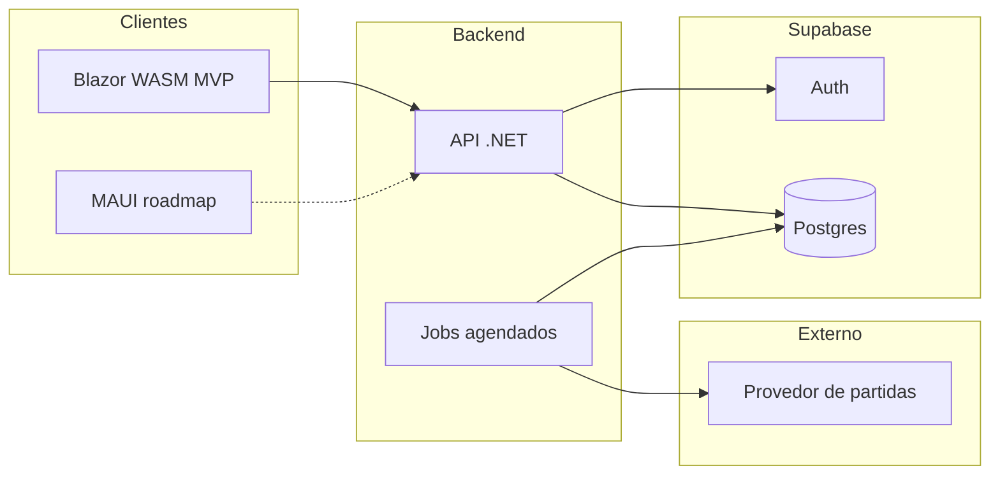

# BigBall — Product Requirements Document (PRD)

**Versão:** 1.4  
**Data:** 28 de abril de 2026  
**Status:** MVP + roadmap pós-MVP

**Engenharia:** decisões de stack, integrações e detalhes de implementação estão em [**TechSpec.md**](./TechSpec.md) (este PRD permanece focado em produto e regras de negócio).

---

## 1. Visão geral

### 1.1 Propósito

**BigBall** (trocadilho com “bolão”) é um hub digital para **criação, participação e acompanhamento de bolões** da **Copa do Mundo FIFA 2026**. Usuários autenticados formam grupos (bolões), registram **palpites antes dos jogos** e acumulam **pontos** conforme a proximidade dos palpites ao resultado real. O vencedor do bolão é quem tiver a **maior soma de pontos** ao final da competição (ou ao fim da janela definida pelo bolão, se aplicável).

### 1.2 Contexto

- A Copa do Mundo 2026 ocorre em **junho–julho de 2026** (calendário oficial FIFA como fonte de verdade para datas e fases).
- O produto deve funcionar em **navegador web** e em **aplicativo mobile** (mesma lógica de negócio e dados; experiências adaptadas a cada plataforma).
- **MVP (entrega inicial):** cliente web em **Blazor WebAssembly** (ver TechSpec). Cliente mobile em **.NET MAUI** é o alvo de plataforma após o MVP web; até lá, o escopo de implementação concentra-se no **Blazor WebAssembly**.

### 1.3 Público-alvo

- Grupos de amigos, famílias e colegas que organizam bolões informais.
- Organizadores que precisam de **código de convite** para bolões privados.
- Participantes que querem **calendário**, **resultados** e **ranking** em um só lugar.

### 1.4 Fora de escopo (MVP)

- Processamento de pagamentos reais integrado ao app (ver seção 7.2 sobre “custo de entrada”).
- Transmissão de vídeo ou conteúdo proprietário da FIFA.
- Apostas reguladas ou integração com casas de apostas (apenas roadmap pós-MVP, opcional).

---

## 2.1 Objetivos de produto (MVP)

1. Permitir **cadastro e login** seguros (e-mail/senha + Google OAuth).
2. Permitir **criar e entrar** em bolões **públicos** e **privados** (código de convite).
3. Exibir **calendário de jogos** e **resultados de partidas encerradas** da Copa 2026.
4. Suportar **palpites** (incluindo palpite de vencedor nos pênaltis no mata-mata, quando aplicável), **pontuação por faixas** (tabela definida na seção 4.8) e **ranking** por bolão, cobrindo **fase de grupos e mata-mata**.
5. Permitir que cada bolão tenha **premiação descrita** e, opcionalmente, **custo de entrada** (informativo / acordo off-platform no MVP).

---

## 3. Personas

### 3.1 Organizador de bolão (“Admin”)

- Cria bolão público ou privado, define nome, regras visíveis (premiação, custo opcional), compartilha código.
- Quer visão clara de **quem entrou**, **deadlines** de palpite e **ranking**.

### 3.2 Participante casual

- Entra por convite ou lista de bolões públicos.
- Quer **poucos passos** para palpitar e ver **próximos jogos** e **resultados**.

### 3.3 Participante engajado

- Acompanha **tabela de classificação do bolão**, histórico de pontos e (futuro) simulações e placar ao vivo.

---

## 4. Funcionalidades — MVP

Cada item inclui **descrição** e **critérios de aceite** resumidos.

### 4.1 Autenticação e conta

**Descrição:** O usuário pode criar conta com **e-mail e senha** ou entrar com **Google (OAuth 2.0)**. Sessão segura; recuperação de senha para e-mail/senha.

**Critérios de aceite:**

- Registro com e-mail: validação de formato, senha com política mínima definida pelo produto (ex.: comprimento e complexidade).
- Login com e-mail/senha e com Google retornam o mesmo tipo de sessão (mesmo modelo de usuário interno).
- Logout invalida sessão no cliente e no servidor (ou revoga refresh token, conforme arquitetura).
- Fluxo “esqueci minha senha” envia link seguro com expiração.

### 4.2 Perfil de usuário (mínimo)

**Descrição:** Nome de exibição e avatar visível nos bolões.

**Critérios de aceite:**

- Usuário pode editar nome de exibição e avatar após login.
- Nome aparece no ranking e na lista de membros do bolão.

### 4.3 Bolão — criação e tipos

**Descrição:**

- **Bolão público:** listado em descoberta (busca/listagem MVP pode ser simples: lista recente ou por nome).
- **Bolão privado:** não aparece em listagem pública; entrada apenas com **código de convite** válido.

**Critérios de aceite:**

- Usuário autenticado cria bolão escolhendo: nome, descrição opcional, tipo (público/privado), premiação (texto), custo de entrada opcional (valor + moeda ou texto livre — ver 7.2).
- Bolão privado gera **código de convite** único e reutilizável.
- Criador é automaticamente **admin** do bolão.

### 4.4 Entrar em bolão

**Descrição:** Entrada em público (fluxo de “participar”) ou privado (inserir código).

**Critérios de aceite:**

- Usuário não pode entrar duas vezes no mesmo bolão.
- Código inválido retorna erro claro; código válido adiciona membro ao bolão.
- Bolão público: botão “Entrar” visível para usuários autenticados não membros.
- Usuário pode se retirar de um bolão a qualquer momento se aquele bolão específico permitir.

### 4.5 Calendário de jogos (Copa 2026)

**Descrição:** Lista ou calendário de **todos os jogos** da Copa (fase de grupos + mata-mata), com data/hora, seleções, fase e estádio (se disponível na fonte de dados).

**Critérios de aceite:**

- Usuário vê jogos agrupados por data ou por fase (MVP: uma das duas, desde que navegável).
- Fuso horário exibido de forma compreensível (preferência do dispositivo ou seletor simples).

### 4.6 Resultados de jogos encerrados

**Descrição:** Para partidas já finalizadas, exibir **placar oficial** (e status “encerrado”) usado para cálculo de pontos. A origem preferencial é **integração automática** (serviços externos de dados); na ausência de dados confiáveis do feed, pode existir **resultado inserido manualmente por um administrador de plataforma** (4.11), **global** para todos os bolões.

**Critérios de aceite:**

- Partida encerrada mostra placar final e não aceita novos palpites.
- Dados de resultado refletem a **fonte vigente** da partida: **se o provedor de dados enviar ou atualizar o resultado**, esse valor **prevalece** sobre qualquer valor manual anterior (4.11); rastreabilidade mínima (origem: provedor vs. manual, quem alterou manualmente e quando).

#### 4.6.1 Estado da partida no provedor (visão produto)

- **Faixas 1–5** da pontuação (secção **4.8**) referem-se **apenas ao tempo regulamentar (TR)**. O **+3** de bônus por pênaltis só se aplica quando houver uma **disputa real de pênaltis** (critérios em 4.8).
- O **provedor de dados** expõe **códigos de estado numéricos** (`status.code` ou equivalente, conforme o contrato da API — ver **TechSpec §6.2.1**) para lógica programática. A separação entre **TR**, **prorrogação** e **disputa de pênaltis** deve ser derivada **sem ambiguidade** dos campos mapeados; o detalhe normativo está no **TechSpec** (§6.2.1 e **§6.2.4**).
- Para **antecipar entrada em prorrogação**, uma sequência útil em atualizações sucessivas (por exemplo sob consultas periódicas) é **segundo tempo → intervalo/halftime antes da prorrogação → início da prorrogação**; já o **fim sem prorrogação** segue o caminho **segundo tempo → fim ao fim do TR**. Transições de códigos e semântica de polling estão no **TechSpec §6.2.4** e §6.2.5.

### 4.7 Palpites

**Descrição:** Para cada jogo em que o membro é **elegível a palpitar** (ver critérios abaixo), informa-se **palpite de placar** (gols mandante x gols visitante). O **fechamento das palpites (lock)** ocorre no **horário de início oficial da partida** (apito inicial divulgado no calendário). Em partidas da **fase eliminatória (mata-mata)**, o membro informa também, no mesmo palpite, **qual seleção venceria uma eventual disputa de pênaltis** (campo obrigatório na UI para jogos de mata-mata; valor usado apenas se a partida de fato for à disputa de pênaltis — ver 4.8).

**Critérios de aceite:**

- **Elegibilidade por partida:** só são aceitos palpites para jogos **ainda não iniciados** no momento da submissão. Se um usuário **entrar no bolão após o início** de uma determinada partida, ele **não poderá registrar palpite** para essa partida **naquele bolão** (a partida aparece como indisponível ou “não elegível” para ele).
- **Escopo do bolão:** todas as partidas da Copa no escopo do produto seguem a mesma regra de elegibilidade acima; membros que já estavam no bolão antes do início da partida podem palpitar até o lock, se ainda dentro da janela.
- Palpite pode ser **alterado** até o lock (**início oficial da partida**).
- Após o lock, o palpite é **somente leitura**.
- **Mata-mata:** o formulário de palpite inclui **vencedor hipotético nos pênaltis** (uma das duas seleções da partida). Se o usuário não preencher antes do lock, o sistema deve **bloquear o envio** do palpite até o campo estar válido.

### 4.8 Pontuação

**Descrição:** Os pontos da partida seguem a tabela abaixo. A **categoria de pontuação** atribuída é a **mais específica** entre as condições verdadeiras para o palpite frente ao resultado de referência — em termos práticos, com as faixas definidas neste PRD, isso corresponde a **sempre escolher a maior pontuação válida** para aquele resultado (uma única faixa por partida, avaliação determinística).

**Referência do placar para as faixas 1–5:** comparar o palpite ao **resultado ao fim do tempo regulamentar (90 minutos + acréscimos)** da partida (“tempo normal”), salvo se o tech spec alinhar explicitamente a outro marcador oficial — a UI deve deixar claro qual placar vale para a pontuação.

| Pontos | Condição (após avaliar placar palpitado vs. resultado no tempo regulamentar)                                                                                                                         |
| ------ | ---------------------------------------------------------------------------------------------------------------------------------------------------------------------------------------------------- |
| **20** | Acertou o placar (gols mandante e visitante iguais ao resultado de referência).                                                                                                                      |
| **16** | Errou o placar, mas acertou o **time vencedor** e a **diferença de gols**; **ou** acertou o **empate** (resultado de referência é empate e o palpite também é empate, com placar diferente do real). |
| **15** | Errou o placar, mas acertou o **time vencedor** e a **quantidade de gols de um dos times** (mandante ou visitante).                                                                                  |
| **10** | Errou o placar, mas acertou apenas o **time vencedor** (e não se enquadra em faixa superior).                                                                                                        |
| **5**  | Errou o placar, mas acertou a **quantidade de gols de um dos times** (e não se enquadra em faixa superior).                                                                                          |
| **0**  | Não se enquadra em nenhuma faixa acima.                                                                                                                                                              |

**Disputa de pênaltis (somente mata-mata):**

- Se a partida **tiver disputa de pênaltis** e o participante acertou o **vencedor da disputa de pênaltis** no campo previsto em 4.7, somam-se **+3 pontos** à pontuação já obtida na partida pelas faixas 1–5 (**bônus aditivo**, não substitui a faixa principal).
- Se **não** houver disputa de pênaltis, o campo de vencedor nos pênaltis **não altera** a pontuação (é ignorado no cálculo).

**Critérios de aceite:**

- Para cada jogo encerrado, o sistema calcula os pontos de cada membro de forma **determinística** e reprodutível (mesma entrada → mesmos pontos).
- O breakdown exibido ao usuário (opcional no MVP, desejável) separa **pontos do tempo regulamentar (faixas 1–5)** e **bônus de pênaltis (+3)** quando aplicável.
- **Ranking do bolão** = **soma** dos pontos por partida; partidas em que o participante **não** tinha palpite válido (incluindo por inelegibilidade na entrada no bolão — 4.7) contam **0 pontos**, salvo decisão explícita no tech spec de excluir tais jogos do denominador em rankings exibidos (o PRD assume **0**).
- **Desempate no ranking do bolão:** em caso de empate na **pontuação total**, ordena-se pelo **número de partidas em que o participante obteve a pontuação máxima da faixa principal (20 pontos)**; vence quem tiver **maior** contagem. Se ainda empatar, aplica-se **recursivamente** a mesma lógica para as faixas seguintes, nesta ordem: **16**, depois **15**, depois **10**, depois **5** pontos por partida. Persistindo o empate, usar **contagem de bônus +3** (pênaltis acertados). Se **ainda** houver empate na **mesma posição** entre **n** participantes (**n** ≥ 2): (1) atribui-se a cada um dos **n** empatados um número **único de 1 a n** (cada palpiteiro recebe exatamente um inteiro distinto no intervalo), na **ordem alfabética crescente do nome de exibição** (PRD 4.2; empates lexicográficos desempatados de forma determinística — ver **TechSpec**); (2) um **participante neutro** — **não** incluído entre esses **n** empatados — realiza o **sorteio de um inteiro em [1, n]**; a **elegibilidade** segue esta **ordem**: **(i)** o **administrador do bolão**, se **não** for um dos **n** empatados; **(ii)** se **(i)** não se aplicar, **outro membro** do mesmo bolão que **não** esteja entre os **n** empatados; **(iii)** se **(ii)** não se aplicar (não houver membro do bolão fora do conjunto dos **n**), **qualquer pessoa** que **não** seja participante do bolão pode atuar como **testemunha** e realizar o sorteio; (3) o participante cujo número foi sorteado fica **acima** dos demais naquele bloco empatado. Se for preciso **ordenar todos os n** (e não só eleger o primeiro entre iguais), repetem-se rodadas entre os remanescentes, renumerando-os de **1** a **n − 1** (e assim por diante) até não restar empate, **reaplicando** a mesma regra de numeração alfabética e de neutro em cada rodada. **Auditoria obrigatória:** participantes empatados, associação número ↔ participante, identidade do **neutro** ou **testemunha**, valor sorteado, data/hora e, se aplicável, rodadas sucessivas (detalhe de persistência no **TechSpec**).

### 4.9 Premiação e custo de entrada (por bolão)

**Descrição:**

- **Premiação:** campo obrigatório (texto); pode ser troféu simbólico, camiseta, pizza, dinheiro combinado fora do app, etc.
- **Custo de entrada:** opcional; no MVP é **informativo** (organizador e membros combinam cobrança fora da plataforma), sem gateway de pagamento obrigatório.

**Critérios de aceite:**

- Criador define premiação na criação; editável por admin (MVP: sempre editável por admin, com ou sem histórico — escolha de implementação).
- Custo opcional exibido na página do bolão de forma visível antes de entrar.

### 4.10 Ranking e detalhe do bolão

**Descrição:** Página do bolão com membros, ranking acumulado, e acesso aos jogos/palpites do bolão.

**Critérios de aceite:**

- Ranking ordenado por **pontuação total decrescente**; em empate na total, aplicar a **cadeia de desempate** definida em **4.8** (contagens por faixa 20 → 16 → 15 → 10 → 5 → bônus +3, depois **sorteio 1..n com participante neutro**).
- Membro vê seus próprios palpites e pontos por jogo (mínimo: lista de jogos com palpite + pontos ganhos).

### 4.11 Entrada manual de resultado (administrador de plataforma, escopo global)

**Descrição:** Quando uma partida **já ultrapassou o horário em que deveria ter sido concluída** (conforme calendário do produto — ex.: início + margem de duração configurada) e **ainda não** houver placar e demais dados necessários ao cálculo vindos do **provedor de dados** (ou estiverem claramente incompletos/incorretos para o uso do bolão), um usuário com **credenciais de administrador de plataforma** (perfil distinto do **administrador de bolão**) pode **inserir ou corrigir manualmente** o resultado **em área administrativa separada**, à qual **apenas** administradores de plataforma têm acesso.

**Escopo e precedência:**

- O resultado manual é **global**: aplica-se a **todos os bolões** e a todos os cálculos de pontuação que dependam daquela partida.
- **Precedência do provedor:** quando o **provedor de dados** posteriormente **enviar ou atualizar** o resultado oficial da partida, esse dado **substitui** o valor manual e passa a ser a **fonte vigente**; o sistema **recalcula** pontuações e rankings afetados de forma idempotente. O histórico de alterações permanece em **auditoria** (valor manual anterior + substituição pelo feed).

**Motivação:** evitar conflitos entre **administradores de bolão** introduzindo placares diferentes para a mesma partida; a governança fica centralizada nos **administradores de plataforma**.

**Critérios de aceite:**

- **Criadores de bolão** e **membros** não têm permissão para alterar placar de partida no MVP.
- Ação disponível somente para **administrador de plataforma**, com confirmação na UI e **auditoria** (operador, data/hora, valores: placar TR, pênaltis / vencedor na disputa conforme 4.8).
- Participantes veem indicador quando o resultado em vigor foi **preenchido manualmente por administrador de plataforma** vs. **provedor**; após sobrescrita pelo provedor, a UI reflete a **precedência do feed**.
- Recálculo de pontos e ranking após cada alteração (manual ou chegada de dado do provedor).

---

## 5. Funcionalidades — pós-MVP (roadmap)

### 5.1 Simulador de resultados

- Projetar classificação/pontuação do bolão **hipotetizando** resultados de jogos ainda não realizados.
- Útil para estratégia e engajamento entre fases.

### 5.2 Placar ao vivo (live scores)

- Atualização de placar e estado da partida enquanto acontece.
- Depende de provedor de dados em tempo real, custo e confiabilidade.

### 5.3 Integração com apostas (opcional)

- Exibir **odds** de diferentes casas, “casa favorita” do usuário, ou apostar pelo app.

**Notas:** implica **compliance legal** forte (jurisdição, idade, licenças). Tratar como fase distante e com assessoria jurídica.

---

## 6. Mecânica do bolão

Esta seção consolida o **modelo mental** do produto (complementa os requisitos das seções 4.7 e 4.8).

### 6.1 O que é um bolão

Um **bolão** é um grupo de pessoas que, para cada partida em que são **elegíveis**, registra um **palpite de placar** (e, no mata-mata, **vencedor hipotético nos pênaltis**) até o **lock** (**início oficial** da partida — ver 4.7). Quando a partida encerra e há resultado válido (**provedor** ou **manual por administrador de plataforma** — 4.11), o sistema atribui **pontos** conforme a seção 4.8. O **ranking** do bolão é a **soma** dos pontos por partida (**0** quando não há palpite válido — 4.8). O **vencedor** (MVP) é o participante com **maior pontuação total**, aplicando o **desempate** da seção **4.8**.

### 6.2 Cobertura de fases (MVP)

- **Fase de grupos** e **todas as fases eliminatórias** até a final.
- **Grupos:** apenas palpite de placar (90 + acréscimos como referência para pontos — ver 4.8).
- **Mata-mata:** placar de referência para as faixas 1–5 = **fim do tempo regulamentar**; o membro informa também, de forma **obrigatória na UI**, o **vencedor hipotético na disputa de pênaltis**; esse campo só entra no cálculo se houver disputa de pênaltis, quando pode somar **+3** pontos se correto (4.8).

### 6.3 Tabela de pontuação (resumo)

Sincronizado com a **seção 4.8**: faixas de **20 / 16 / 15 / 10 / 5 / 0** pontos com base no placar no tempo regulamentar; **+3** aditivos se houver pênaltis no mata-mata e o palpite de vencedor na disputa estiver correto.

---

## 7. Regras de negócio complementares

### 7.1 Pagamentos

- MVP: **sem** obrigatoriedade de integração financeira; custo de entrada é **declaratório**.
- Evolução: integração com pagamentos (PIX, cartão, etc.) como produto separado com requisitos legais.

### 7.2 Moderação e conduta (mínimo)

- Nomes e descrições de bolões **públicos** são visíveis na descoberta: recomenda-se no MVP **filtro básico de termos**, **canal de denúncia** ou **contato de suporte** por e-mail.

---

## 8. Modelo de dados (alto nível)

| Entidade                        | Descrição                                                                                                                                                                                                                                                                                                                                                                                                                                                       |
| ------------------------------- | --------------------------------------------------------------------------------------------------------------------------------------------------------------------------------------------------------------------------------------------------------------------------------------------------------------------------------------------------------------------------------------------------------------------------------------------------------------- |
| Identidade + `profiles`         | **Conta:** fonte da verdade em **`auth.users`** (Supabase Auth). **Perfil de produto** (nome de exibição, avatar, metadados de app): tabela **`profiles`** com **`id` = `auth.users.id`** (1:1). **Sem** tabela de usuário duplicada/espelhada além de `profiles`. **Papéis** (ex.: **administrador de plataforma** para 4.11 vs **administrador de bolão**) conforme modelagem no TechSpec (claims/metadata e/ou colunas em `profiles` ou tabelas de domínio). |
| `Pool` (Bolão)                  | Nome, tipo público/privado, código de convite, admin, premiação, custo opcional, timestamps.                                                                                                                                                                                                                                                                                                                                                                    |
| `PoolMembership`                | Usuário ↔ bolão, papel (admin/member), **data/hora de entrada no bolão** (para elegibilidade de palpite por partida — 4.7).                                                                                                                                                                                                                                                                                                                                     |
| `Match`                         | Times, fase, data/hora de início, status, placar de referência (TR), flags de pênaltis / vencedor na disputa, **origem vigente do resultado** (provedor vs. **manual por administrador de plataforma**), carimbo de **última atualização do provedor**, metadados de **auditoria** (incl. substituição manual → provedor).                                                                                                                                      |
| `Prediction`                    | Usuário, bolão, partida, placar palpitado (mandante x visitante), **vencedor nos pênaltis** (apenas mata-mata; nulo ou ignorado se não aplicável), momento de lock.                                                                                                                                                                                                                                                                                             |
| Pontos (derivado ou persistido) | Pontos por (usuário, partida, bolão); materializado ou calculado on read (decisão de engenharia).                                                                                                                                                                                                                                                                                                                                                               |

**Relacionamentos chave:**

- Usuário autenticado (`auth.users` / `profiles`) 1:N `PoolMembership` N:1 `Pool`
- Par (usuário, `Pool`, `Match`) tem no máximo um `Prediction`
- `Match` atualizado por **jobs** (feed do provedor), com **atualização manual** restrita a **administrador de plataforma** nos casos da seção **4.11**; o feed do provedor **sobrescreve** o manual quando disponível

---

## 9. Arquitetura de referência (produto)

Os **detalhes de stack**, provedores, auth, jobs e schema estão no [**TechSpec.md**](./TechSpec.md). Aqui ficam só os **princípios** alinhados ao produto.

### 9.1 Princípios

- **Backend único** (API) com regras de negócio e dados sensíveis centralizados; clientes consomem essa API.
- **MVP:** cliente **Blazor WebAssembly** (web). **Roadmap:** cliente **.NET MAUI** (mobile), mesma API e mesmo domínio.
- **Conta e perfil:** identidade em **Supabase `auth.users`**; dados de perfil em **`profiles`** (`id` = usuário), sem tabela de usuário espelhada (ver secção 8).
- **Partidas:** integração com **provedor externo** de dados + **fallback manual global** (4.11); o **provedor prevalece** quando atualizar (requisitos de produto já nas secções 4.6 e 4.11).

### 9.2 Componentes (visão lógica)

---

## 10. Requisitos não funcionais

| Área            | Requisito                                                                                                                                                                           |
| --------------- | ----------------------------------------------------------------------------------------------------------------------------------------------------------------------------------- |
| Segurança       | HTTPS; credenciais geridas pelo provedor de auth (p.ex. Supabase) com boas práticas equivalentes a hashing forte; rate limit em login; validação de entrada (detalhes no TechSpec). |
| Privacidade     | LGPD/GDPR-ready: base legal; exportação/exclusão de conta (mínimo no roadmap: canal de solicitação).                                                                                |
| Performance     | Listagens principais com tempo de resposta adequado em rede móvel típica (alvo orientativo: ordem de poucos segundos); cache do calendário quando aplicável.                        |
| Provedor de dados | Usar o **mínimo** de chamadas HTTP ao provedor **compatível** com resultado oficial correto e com o cálculo de pontuação (4.6–4.8). Orçamentos, janelas temporais e cadência dinâmica são **exclusivamente de engenharia** — ver **TechSpec** (jobs §4.6, sincronização **quota-aware**, §6.2.5). |
| Disponibilidade | Na janela da Copa, meta de uptime elevada; comunicação de incidentes (status page ou equivalente).                                                                                  |
| Acessibilidade  | Web: práticas WCAG de forma progressiva no MVP (contraste, labels, foco).                                                                                                           |

---

## 11. Riscos e pontos em aberto

| Risco                                                                        | Impacto                                     | Mitigação                                                                                                                                                                                                                                                     |
| ---------------------------------------------------------------------------- | ------------------------------------------- | ------------------------------------------------------------------------------------------------------------------------------------------------------------------------------------------------------------------------------------------------------------- |
| Confiabilidade da API de jogos/placares                                      | Palpites e pontos incorretos ou atrasados   | Provedor MVP (**SportsAPI Pro**, TechSpec); **entrada manual global** por **administrador de plataforma** (4.11); **reconciliação** quando o feed ultrapassar o manual; avaliação pré-Copa de migração (ex. **FlashScore** via RapidAPI, TechSpec); auditoria |
| Erro humano em resultado manual por administrador de plataforma              | Pontuação errada em massa (todos os bolões) | Confirmação em dois passos, auditoria, treinamento; precedência do **provedor** assim que corrigir o feed                                                                                                                                                     |
| Regra de resultado (TR vs prorrogação vs pênaltis) vs expectativa do usuário | Reclamações                                 | PRD fixa faixas 1–5 sobre **TR**; bônus +3 só com disputa real de pênaltis; UI + FAQ explicando isso; **mapeamento explícito** no adapter do feed → modelo canónico (**TechSpec** 6.2); sem inferir TR de “final” ambíguo; 4.11 quando houver lacuna |
| Custo de entrada sem pagamento in-app                                        | Atrito entre organizador e grupo            | Texto claro de que o valor é acordado fora da plataforma no MVP                                                                                                                                                                                               |
| Pico de carga em jogos populares                                             | Lentidão ou erros                           | Escalabilidade horizontal da API; CDN para assets estáticos                                                                                                                                                                                                   |

**Decisões já definidas (resumo):**

- **Atribuição de faixa de pontos:** escolher a **categoria mais específica** verdadeira; na prática, com as faixas deste PRD, **a maior pontuação válida** (4.8).
- **Desempate no ranking:** contagens recursivas por faixa — **20 → 16 → 15 → 10 → 5** pontos por partida; em seguida **número de bônus +3**; se ainda empatar, **sorteio em [1, n]** após numerar os **n** empatados, conduzido por **participante neutro** fora do grupo empatado, com **auditoria** (4.8 e 4.10).
- **Lock de palpites:** no **início oficial** da partida (4.7).
- **Elegibilidade:** só jogos **não iniciados**; quem **entra no bolão após o início** de uma partida **não palpita** nessa partida naquele bolão (4.7).
- **Resultado sem feed / conflitos entre bolões:** apenas **administrador de plataforma** insere resultado **manual global** (4.11); **provedor de dados tem precedência** quando atualizar.
- **Desempate final no ranking:** numeração **1..n** por **ordem alfabética do nome de exibição** + sorteio por **neutro/testemunha** (ordem de elegibilidade em 4.8) + **auditoria** (4.8).
- **Provedor de dados (MVP):** [**SportsAPI Pro**](https://docs.sportsapipro.com/introduction) para desenvolvimento e testes; **produção** a confirmar após critérios no **TechSpec** (manter ou migrar, ex. [**FlashScore** na RapidAPI](https://rapidapi.com/rapidapi-org1-rapidapi-org-default/api/flashscore4)).
- **Identidade:** **`auth.users`** (Supabase) + **`profiles`** (`id` 1:1); sem tabela de usuário espelhada.
- **Clientes:** **Blazor WebAssembly** (MVP web); **.NET MAUI** (mobile) após o MVP web.
- **TR vs prorrogação / feed ambíguo:** o **TechSpec** 6.2 define **mapeamento campo-a-campo** por provedor para o modelo canónico; **não** inferir placar de TR a partir de resultado “final” quando houver prorrogação ou pênaltis sem campo explícito de TR; lacunas tratadas pelo **PRD 4.11** até o feed (ou mapeamento) ficar inequívoco, mantendo a **precedência do provedor**.
- **Participante neutro / testemunha (4.8):** **(i)** administrador do bolão, se **não** for um dos **n** empatados; **(ii)** se **(i)** não aplicar, outro **membro** do bolão fora dos **n**; **(iii)** se **(ii)** não aplicar, **qualquer pessoa não participante** do bolão como testemunha. O neutro/testemunha **nunca** pertence ao conjunto dos **n** empatados na rodada em curso.
- **Numeração 1..n (4.8):** ordem **alfabética crescente** pelo **nome de exibição** (4.2); desempates lexicográficos e persistência conforme **TechSpec** §7.

---

## 12. Glossário

| Termo                           | Significado                                                                                                                                                                                                                                                        |
| ------------------------------- | ------------------------------------------------------------------------------------------------------------------------------------------------------------------------------------------------------------------------------------------------------------------ |
| Bolão                           | Grupo de pessoas que palpitam jogos e competem por pontuação acumulada.                                                                                                                                                                                            |
| Lock                            | Instant em que palpites não podem mais ser criados ou alterados: **início oficial** da partida (4.7).                                                                                                                                           |
| 1X2                             | Três estados de resultado: vitória mandante / empate / vitória visitante (conforme o placar de referência usado na pontuação).                                                                                                                                     |
| Tempo regulamentar (TR)         | 90 minutos + acréscimos; usado como referência para as faixas 1–5 da seção 4.8.                                                                                                                                                                                    |
| Bônus de pênaltis               | +3 pontos somados à partida se houver disputa de pênaltis e o vencedor nela for o palpitado (mata-mata).                                                                                                                                                           |
| Participante neutro             | Quem **realiza o sorteio** em **[1, n]** (4.8), **fora** do conjunto dos **n** empatados. **Elegibilidade (por ordem):** **(i)** administrador do bolão, se não for um dos **n**; **(ii)** se **(i)** não aplicar, outro membro do bolão fora dos **n**; **(iii)** se **(ii)** não aplicar, **qualquer pessoa não participante** do bolão como **testemunha**. |
| Sorteio com participante neutro | Após esgotar contagens por faixa (4.8): os **n** empatados recebem números **1..n** pela **ordem alfabética do nome de exibição**; o **neutro** ou **testemunha** sorteia em **[1, n]**; exige **auditoria**; rodadas adicionais até ordenar o bloco, **reaplicando** numeração e regra de neutro em cada rodada (persistência no TechSpec). |
| Testemunha (sorteio)            | Pessoa **fora** do bolão usada na etapa **(3)** da elegibilidade do **participante neutro** quando não existe administrador nem outro membro elegível para conduzir o sorteio.                                                                                      |
| Administrador de plataforma     | Papel com acesso à área administrativa para **resultado manual global** de partidas (4.11); distinto do **administrador de bolão**.                                                                                                                                |

---

## 13. Próximos passos

1. Implementar **lock no apito (início oficial)**, **elegibilidade pós-entrada no bolão**, **cadeia de desempate** do ranking e **sorteio 1..n com participante neutro** conforme 4.7–4.8; área administrativa de **administrador de plataforma** para resultado manual global (4.11) e **reconciliação** com o feed do provedor.
2. Manter o [**TechSpec.md**](./TechSpec.md) como fonte viva de **schema**, **jobs** de atualização de placar, integração com o provedor (adapter, variáveis de ambiente) e plano de avaliação para **produção** (manter vs. [FlashScore na RapidAPI](https://rapidapi.com/rapidapi-org1-rapidapi-org-default/api/flashscore4)).
3. Protótipo de UX: fluxos criar bolão, entrar com código, palpitar, ranking.
4. Implementação do MVP conforme priorização de engenharia/produto.

---

_Documento vivo: revisar após testes de carga/cobertura do provedor escolhido para produção e após pilotos com usuários._
