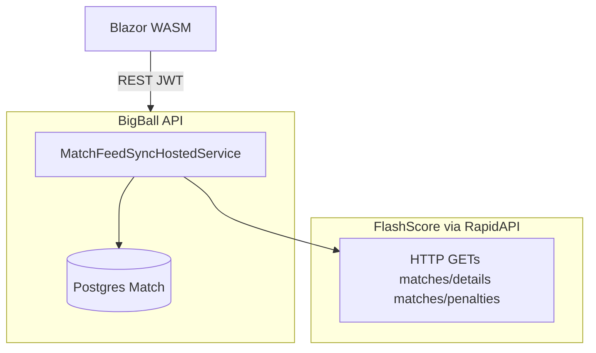

# BigBall — Technical Specification (Tech Spec)

**Versão:** 1.4  
**Data:** 22 de maio de 2026  
**Documento relacionado:** [PRD.md](./PRD.md) — requisitos de produto, regras de pontuação, lock, elegibilidade e auditoria **não** são repetidos aqui; este ficheiro cobre **stack**, integrações e decisões de implementação.

---

## 1. Objetivo deste documento

Definir a **stack**, os **limites de responsabilidade** entre componentes e os **requisitos de engenharia** necessários para implementar o MVP descrito no PRD, evitando duplicar texto normativo do produto.

---

## 2. Visão da arquitetura

| Camada | Tecnologia | Função |
| ------ | ---------- | ------ |
| Auth e Postgres gerido | **Supabase** | Autenticação (e-mail/senha, Google OAuth), `auth.users`, Postgres, Storage (avatars), políticas de rede/segredos no painel. |
| API e regras de negócio | **ASP.NET Core** (Web API, REST) | Única fonte de verdade para palpites, elegibilidade, pontuação, ranking, admin de plataforma (4.11 no PRD). |
| Jobs | **ASP.NET Core** (Hosted Service / Worker dedicado) ou processo separado na mesma solução | Sincronização com provedor de partidas, recálculo idempotente quando o feed substituir resultado manual. |
| Cliente web (MVP) | **Blazor WebAssembly** | UI pública e autenticada; chama a API com JWT emitido pelo Supabase Auth. |
| Cliente mobile (roadmap) | **.NET MAUI** | Mesmo contrato de API que o Blazor; **fora do escopo de implementação do MVP inicial** (PRD 1.2). |

Fluxo típico: o usuário autentica-se via **Supabase Auth** → o cliente obtém **access token (JWT)** → pedidos à **API .NET** com `Authorization: Bearer <jwt>` → a API valida o token e acede ao Postgres (Supabase) com permissões adequadas (ligação servidor + princípio do menor privilégio).

---

## 3. Supabase

### 3.1 Identidade e perfil

- **Conta:** `auth.users` é a **única** fonte de verdade para identidade (e-mail, providers OAuth, ids).
- **Perfil de produto:** tabela `profiles` com **`id` UUID = `auth.users.id`** (relação 1:1). Campos esperados incluem, no mínimo, alinhados ao PRD 4.2: nome de exibição, referência a avatar (URL ou path em Storage).
- **Não** existe tabela de “usuário de aplicação” espelhada além de `profiles`; FKs de domínio (`pool_memberships`, `predictions`, etc.) referenciam `profiles.id` (equivalente a `auth.users.id`).

### 3.2 Papéis (administrador de plataforma vs admin de bolão)

O PRD distingue **administrador de plataforma** (4.11) de **administrador de bolão**. A atribuição concreta é decisão de implementação, por exemplo:

- `profiles.is_platform_admin` (boolean), **ou**
- claim em `app_metadata` / `user_metadata` sincronizado via trigger ou processo de onboarding,

desde que a **API .NET** consiga avaliar autorização de forma consistente e testável. Documentar a opção escolhida aqui quando implementado.

### 3.3 Storage

- Bucket para **avatars** (público restrito ou assinatura de URL, conforme política de privacidade).
- Upload pode ser mediado pela API (service role) ou por políticas RLS no cliente; o PRD não impõe o caminho — o Tech Spec recomenda **não expor service role no Blazor** e preferir **API ou Supabase Storage com RLS** alinhada ao `id` do usuário.

### 3.4 Row Level Security (RLS)

Opcional no MVP se **todo** o acesso a dados sensíveis passar pela API com credencial de servidor. Se no futuro o cliente ler/escrever Postgres diretamente, as políticas RLS devem espelhar as mesmas regras da API. Para o MVP centrado em Blazor + API, **RLS pode ficar em modo restritivo mínimo** (apenas service/backend) até abrir acesso direto.

---

## 4. Backend .NET

### 4.1 Projeto e runtime

- **.NET 8+** (LTS na data do documento).
- Projeto **ASP.NET Core Web API**, OpenAPI (Swashbuckle ou nativo) para contratos e testes.

### 4.2 Acesso a dados

- **Entity Framework Core** com provider **Npgsql** contra o Postgres do Supabase, **ou** Dapper onde queries complexas (ex. ranking) beneficiem de SQL explícito.
- **Migrations** versionadas no repositório; connection string apenas em servidor/CI (nunca no WASM).

### 4.3 Autenticação na API

- **JWT Bearer:** validação de tokens emitidos pelo Supabase (issuer, audience e JWKS conforme documentação atual do projeto Supabase).
- O `sub` do JWT identifica o usuário; joins com `profiles` para nome/avatar em respostas.

### 4.4 Autorização

- **Policy-based** authorization: membro de bolão, admin de bolão, admin de plataforma.
- Rate limiting nativo em rotas de autenticação/auxiliares expostas pela API (alinhado ao PRD, secção 10).

### 4.5 Integração com o provedor de partidas

- Cliente HTTP resiliente (**HttpClient** + **Polly**: retry, circuit breaker).
- Configuração por ambiente (`IOptions`): URL base, chave API, timeouts. **Apenas o backend (.NET)** chama o provedor — clientes nunca seguram chaves.
- **Adapter** isolado por trás de `ISportsDataSource` (em `BigBall.Domain.SportsData`): mapeia o payload do fornecedor para o modelo canónico `SportsMatchSnapshot`, segundo as regras de **mapeamento explícito** da **secção 6.2** (sem inferir TR a partir de “final” ambíguo).
- **Adapter vigente (MVP):** `FlashScoreSportsDataSource` (FlashScore via RapidAPI). Usa **no máximo 2 GETs por partida** — `…/matches/details` (obrigatório) e, condicionalmente, `…/matches/penalties` quando há disputa de pênaltis (§6.2.2). Sem WebSocket no MVP.
- O adapter `SportsApiProSportsDataSource` permanece no código (`BigBall.Api/Integrations/SportsApiPro/*`) como **reserva/histórico** e referência de mapeamento (§6.2.1); não está registado em DI por padrão.

### 4.6 Jobs agendados

- Sincronizar calendário/estado/placar; ao detetar atualização do provedor que substitui resultado manual, disparar **recálculo idempotente** de pontos e rankings (PRD 4.11).
- Implementação atual: **`MatchFeedSyncHostedService`** (`BackgroundService`) parametrizado por **`MatchProviderSyncOptions`** (provider-agnóstico, secção JSON `MatchProviderSync`). A cadência é decidida pela fase canónica `MatchLifecyclePhase` via `MatchPollingIntervals.GapForPhase` — ver §6.2.5 para política quota-aware.

---

## 5. Clientes .NET

### 5.1 Blazor WebAssembly (MVP)

- Consome a API REST; armazena tokens em memória/`localStorage` conforme trade-off de segurança vs UX (refresh token: seguir recomendações Supabase + ameaças XSS).
- Não embute **chaves** do provedor de dados desportivos nem **service role** do Supabase.

### 5.2 .NET MAUI (pós-MVP)

- Mesmo modelo: JWT no header; armazenamento seguro de credenciais (Keychain / Keystore).
- Partilha opcional de **cliente HTTP** / DTOs via biblioteca de projeto comum (`BigBall.Client.Core` ou similar) — decisão na implementação.

---

## 6. Provedor de dados esportivos

A escolha do fornecedor **não bloqueia** o modelo canónico `Match`, desde que o adapter preencha os campos necessários ao PRD (TR, pênaltis, início oficial para lock, etc.).

| Fase | Provedor alvo | Observação |
| ---- | ------------- | ---------- |
| **MVP — desenvolvimento, testes e produção** | [FlashScore via RapidAPI](https://rapidapi.com/rapidapi-org1-rapidapi-org-default/api/flashscore4) | REST. Adapter `FlashScoreSportsDataSource` cabeado por padrão (`SportsData:Provider=FlashScore`). Auth via headers `X-RapidAPI-Key` + `X-RapidAPI-Host`. Mapeamento campo-a-campo em §6.2.2. |
| **Legado / reserva (não cabeado)** | [SportsAPI Pro](https://docs.sportsapipro.com/introduction) | Adapter `SportsApiProSportsDataSource` permanece em `BigBall.Api/Integrations/SportsApiPro/*` para fallback. Mapeamento histórico em §6.2.1. Para reativar: adicionar branch `SportsApiPro` em `SportsDataServiceCollectionExtensions.AddSportsData` e definir `SportsData:Provider=SportsApiPro`. |

### 6.1 Requisitos de engenharia (partidas)

1. Parametrizar **chaves e URLs** por ambiente (dev/staging/prod); **nunca** expor API keys no Blazor WASM nem em repositórios públicos.
2. Manter o **mapeamento campo-a-campo** por provedor na **secção 6.2** (tabelas vivas); ao implementar, pode duplicar um resumo em comentário no código do adapter apontando para o commit referenciado em 6.1.3.
3. Registar **versão/commit** (e data) sempre que o **payload do provedor** ou a **tabela de mapeamento** mudar — rastreabilidade junto à auditoria do PRD 4.11.

### 6.2 Mapeamento explícito no adapter (TR, prorrogação e pênaltis)

**Decisão:** cada integração com um fornecedor de dados desportivos deve definir e manter um **mapeamento explícito** (caminho JSON / nome de campo / transformação documentada) do payload do fornecedor para o **modelo canónico** usado pelo BigBall. O placar de **tempo regulamentar (TR)** usado nas faixas 1–5 do PRD **só** pode ser preenchido a partir de **campos do feed que correspondam inequivocamente** a “gols ao fim do TR (90 min + acréscimos)” **ou** a partir do **fluxo manual global** do PRD 4.11.

**Proibição:** **não** deduzir TR a partir de um único par “mandante × visitante” rotulado como *final* / *full time* / equivalente **quando** o próprio feed (ou outros campos mapeados) indicar **prorrogação** ou **disputa de pênaltis** **e** não existir, no mapeamento, origem explícita para o placar **ao fim do TR**. Nesses casos o adapter marca lacuna conforme coluna **Gap** abaixo e o sistema segue o PRD 4.11 até o feed ou o mapeamento permita TR confiável (mantendo a **precedência do provedor** quando este atualizar dados inequívocos).

**Modelo canónico (alvos do mapeamento)** — nomes orientativos; o schema persistido pode diferir:

| Alvo canónico | Uso |
| ------------- | --- |
| ID estável da partida no fornecedor | Jobs, deduplicação, correlação manual ↔ feed |
| Início oficial da partida | Fechamento de palpites (no apito, PRD 4.7) |
| Estado / fase da partida | Elegibilidade, UI, decisão de recálculo |
| Gols mandante **ao fim do TR** | Pontuação faixas 1–5 |
| Gols visitante **ao fim do TR** | Idem |
| `went_to_extra_time` (booleano, recomendado) | Validação cruzada com “final” ambíguo; UI |
| `went_to_penalty_shootout` (booleano) | Bônus +3 |
| Identificador do **vencedor na disputa de pênaltis** | Bônus +3 (PRD 4.8) |
| Metadados de **origem vigente** do resultado | PRD 4.6, 4.11 |

#### 6.2.1 Tabela de mapeamento — SportsAPI Pro (legado / não cabeado)

Implementação de referência no repositório: `SportsApiProMapper` (leitura de estado via `GetStatusCode`, conversão via `MapLifecycleFromStatus`). O nó **`event`** obtém-se da raiz da resposta como `event`, `data`, ou raiz quando já contém `id` / `startTimestamp`.

**Endpoints REST típicos (tier Football):** pedido principal `GET …/api/match/{id}`; opcionais **`/scores`** e **`/penalties`** quando o snapshot exigir enriquecimento (o custo acumulado de HTTP é tratado em **§6.2.5**).

| Alvo canónico | Campo / path no payload (SportsAPI Pro) | Notas | Gap |
| ------------- | ---------------------------------------- | ----- | --- |
| ID estável da partida | `event.id` | ID numérico do fornecedor; no domínio tratar como string estável | não |
| Início oficial | `event.startTimestamp` | Epoch Unix em **segundos** (UTC) no adapter; normalizar para instante único no domínio | não |
| Estado da partida | `event.status.statusCode` **ou** `event.status.code`; fallback: valor numérico em `event.status` | Cruzar com a tabela **código → fase canónica** abaixo | não |
| Gols mandante (TR) | `event.homeScore.normaltime`; alternativa **soma** `homeScore.period1` + `homeScore.period2`; último recurso `homeScore.display` / `homeScore.current` (apenas onde o código marca fiabilidade — ver `ExtractRegularTimeGoals`) | Não usar `display` como TR após EST/pênaltis sem `normaltime` ou lógica explícita | **sim** se, em fase pós‑TR, não existirem campos suficientes e o adapter assinalar lacuna TR |
| Gols visitante (TR) | `event.awayScore.*` (espelho de mandante) | Idem quanto a `normaltime` vs períodos vs display | idem |
| Houve prorrogação | *inferido dos códigos de estado* (40, 41, 110, …) | Não depende de um boolean dedicado obrigatório no JSON quando o ciclo de vida está coberto pelo código | não (desde que o código seja atualizado) |
| Houve disputa de pênaltis | *inferido dos códigos* (50, 120, …) | Complementar com payload de **`/penalties`** quando aplicável | pode ser **sim** até existir resultado explícito |
| Vencedor na disputa de pênaltis | Resposta `…/penalties` e campos agregados (ex.: `homePenaltyScore` / `awayPenaltyScore`, `winnerTeamId`, `winnerIsHomeTeam` — conforme payload real) | Bônus +3 só com disputa real (PRD 4.8) | **sim** se o endpoint não for obtido ou estiver incompleto |

**Código numérico (`status`) → fase canónica** (`MatchLifecyclePhase` — espelho de `MapLifecycleFromStatus`):

| `status.statusCode` / `status.code` | Fase canónica |
| ----------------------------------- | ------------- |
| `0` | `NotStarted` |
| `6` | `FirstHalf` |
| `7` | `SecondHalf` |
| `31` | `Halftime` |
| `40` | `ExtraTimeFirstHalf` |
| `41` | `ExtraTimeSecondHalf` |
| `50` | `PenaltyShootoutInProgress` |
| `60` | `Postponed` |
| `70` | `Canceled` |
| `80` | `Interrupted` |
| `90` | `Abandoned` |
| `100` | `FinishedRegulation` |
| `110` | `FinishedAfterExtraTime` |
| `120` | `FinishedAfterPenalties` |
| *outros / ausente* | `Unknown` |

#### 6.2.2 Tabela de mapeamento — FlashScore (RapidAPI) — provedor vigente

Implementação de referência no repositório: `FlashScoreMapper` + `FlashScoreSportsDataSource` (`BigBall.Api/Integrations/FlashScore/*`). Auth via `FlashScoreApiKeyHandler` (`X-RapidAPI-Key`, `X-RapidAPI-Host`).

**Endpoints REST (RapidAPI):**

- `GET /api/flashscore/v2/matches/details?match_id={id}` — payload **principal** (1 GET por refresh).
- `GET /api/flashscore/v2/matches/penalties?match_id={id}` — **condicional**: o adapter só chama quando o JSON principal sinaliza disputa de pênaltis (`match_status.is_finished_after_penalties == true` ou `scores.home_penalties`/`away_penalties` preenchidos).
- `GET /api/flashscore/v2/matches/list-by-date?sport_id=1&date={yyyy-MM-dd}` — schedule diário usado por `MatchScheduleCorrelationService.TryHydrateSportsApiIdAsync`.

**Custo típico por partida:** 1 GET pré-pênaltis; 2 GETs durante/após pênaltis. **Sem WebSocket.**

| Alvo canónico (`SportsMatchSnapshot`) | Campo / path no payload FlashScore | Notas | Gap |
| ------------------------------------- | ----------------------------------- | ----- | --- |
| `ExternalMatchId` | `match_id` (string) | Identificador estável do RapidAPI; não numérico (ex.: `"GCxZ2uHc"`). | não |
| `KickoffUtc` | `timestamp` (epoch Unix **segundos**, UTC) | Normalizado via `DateTimeOffset.FromUnixTimeSeconds` no `FlashScoreMapper`. | não |
| `Phase` (`MatchLifecyclePhase`) | derivada de **flags** em `match_status` + presença de campos em `scores` — ver §6.2.4 | Sem código numérico; lógica em `FlashScoreMapper.MapLifecycle`. | não |
| `ProviderStatusCode` | — | Sempre **null** para FlashScore; campo legado preservado por compatibilidade com SportsAPI Pro. | n/a |
| `GoalsHomeRegularTime` | `scores.home_total`; fallback `scores.home_1st_half + scores.home_2nd_half` | FlashScore expõe totais limpos em todas as fases. | não |
| `GoalsAwayRegularTime` | `scores.away_total`; fallback equivalente | Idem. | não |
| `RegularTimeScoresReliable` | computado a partir da fase + totais presentes (`FlashScoreMapper.ExtractRegularTimeGoals`) | True para `FinishedRegulation`/`After*` e fases ao vivo a partir de `SecondHalf`. | não |
| `WentToExtraTime` | `match_status.is_finished_after_extra_time` **ou** `scores.home_extra_time`/`away_extra_time` não-nulos **ou** fase implica EST | Combinação de sinais. | não |
| `WentToPenaltyShootout` | `match_status.is_finished_after_penalties` **ou** `scores.home_penalties`/`away_penalties` não-nulos **ou** fase implica pênaltis | Idem. | não |
| `PenaltyWinnerIsHome` | `match_status.final_winner` (`"home"` / `"away"`); fallback `scores.home_penalties` vs `scores.away_penalties`; último recurso payload de `…/penalties` | Bônus +3 (PRD 4.8) só com disputa real. | **sim** se `is_finished_after_penalties=true` e `final_winner` ausente e placares de pênaltis empatados/ausentes. |
| `ResultOrigin` | computado em `FlashScoreMapper.ResolveResultOrigin` | `ProviderComplete` para fase terminal com TR confiável; `GapRegularTimeUnresolved` quando fase exige TR mas totais ausentes. | — |

**Provedor adicional ou migração futura:** criar **nova** tabela com a mesma estrutura de alvos canónicos; **não** reutilizar paths sem revisão. O modelo `SportsMatchSnapshot` e o enum `MatchLifecyclePhase` são o contrato estável que todos os adapters devem produzir.

#### 6.2.3 Comportamento quando Gap = sim ou TR inválido

O job de sincronização **não inventa** gols de TR. Se a partida, pelo calendário interno, exigir resultado para pontuação e o canónico **TR** estiver indisponível ou marcado como gap: aplicar **PRD 4.11** (administrador de plataforma); quando o feed passar a fornecer TR mapeável, **prevalece** o provedor e dispara-se recálculo idempotente.

#### 6.2.4 Semântica tempo regulamentar / prorrogação / pênaltis (FlashScore — provedor vigente)

Leitura **normativa** em conjunto com a tabela em **§6.2.2** e com o PRD (faixas 1–5 = TR em 4.8). FlashScore **não usa códigos numéricos**: a fase canónica é derivada de **flags booleanas** em `match_status` combinadas com a presença de campos em `scores`.

**Tabela de derivação de `MatchLifecyclePhase` (em `FlashScoreMapper.MapLifecycle`, primeira regra que casa):**

| Fase canónica | Condição |
| ------------- | -------- |
| `Canceled` | `match_status.is_cancelled == true` |
| `Postponed` | `match_status.is_postponed == true` |
| `FinishedAfterPenalties` | `match_status.is_finished_after_penalties == true` |
| `FinishedAfterExtraTime` | `match_status.is_finished_after_extra_time == true` |
| `FinishedRegulation` | `match_status.is_finished == true` (sem as flags acima) |
| `PenaltyShootoutInProgress` | `is_in_progress == true` + `scores.home_penalties`/`away_penalties` presentes |
| `ExtraTimeFirstHalf` | `is_in_progress == true` + `scores.home_extra_time`/`away_extra_time` presentes (a granularidade ET-1 vs ET-2 não está exposta; assume-se ET-1 e o polling reclassifica) |
| `SecondHalf` | `is_in_progress == true` + `scores.home_2nd_half` ou `away_2nd_half` > 0 |
| `FirstHalf` | `is_in_progress == true` (sem sinais acima) |
| `Halftime` | `is_started == true` + **não** `is_in_progress` + **não** `is_finished` (inferência) |
| `NotStarted` | nenhum dos acima |
| `Unknown` | `match_status` ausente |

**Fim do tempo regulamentar (TR):** ocorre quando a fase é `FinishedRegulation`, `FinishedAfterExtraTime` ou `FinishedAfterPenalties`. O placar TR vem de **`scores.home_total` / `scores.away_total`** (sempre expostos) com fallback **`home_1st_half + home_2nd_half`** quando os totais estiverem ausentes.

**Limitação importante (cf. PRD 4.6.1):** FlashScore **não expõe o minuto corrido** no payload de detalhes; a distinção fina entre 1H / 2H / Halftime / ET-1 / ET-2 depende de polling periódico e dos campos auxiliares de score por período. Para o produto (cálculo de pontos), apenas a fronteira **terminal vs não-terminal** importa — e essa é inequívoca via as flags `is_finished*`.

**Transição típica para antecipar prorrogação:** `SecondHalf` → `Halftime` (intervalo antes da ET) → `ExtraTimeFirstHalf` (presença de `home_extra_time`/`away_extra_time`) → `FinishedAfterExtraTime` ou `PenaltyShootoutInProgress` → `FinishedAfterPenalties`. Caminho sem prorrogação: `SecondHalf` → `FinishedRegulation` direto. Automatismos toleram payloads atrasados ou fora de ordem.

Referência §4.6 (jobs): a sincronização quota‑aware (**§6.2.5**) opera sobre a fase canónica via `MatchPollingIntervals.GapForPhase` e é provider-agnóstica.

#### 6.2.5 Sincronização quota‑aware com o provedor

Objetivo: respeitar **limites económicos e operacionais** do fornecedor (pedidos REST diários/contratuais) mantendo resultado **correto** para placar oficial e pontuação (PRD 4.6–4.8). Os **intervalos numericamente concretos** ficam em **configuração** (`appsettings` / secrets), não neste texto.

**Separação de responsabilidades**

- **Somente o backend (.NET)** invoca HTTP ao provedor (atualmente **FlashScore via RapidAPI**). Clientes (Blazor, MAUI, etc.) consomem apenas a **API BigBall** (JWT), alinhado a §§4.5–4.6 e PRD §9.

**Custo atual por refresh (FlashScore — provedor vigente)**

- **Até 2 GETs HTTP** por ciclo de leitura de uma partida: **`GET …/matches/details`** (sempre) e, condicionalmente, **`GET …/matches/penalties`** (apenas quando o adapter detecta sinal de disputa de pênaltis — `FlashScoreMapper.ShouldRequestPenaltiesEndpoint`). **Orçamento diário deve contabilizar chamadas HTTP**, não só "número de jogos tocados".
- **Política de redução (direção de desenho):** preferir `…/matches/details` por já trazer placar TR limpo (`scores.home_total` / `away_total`); só chamar `…/matches/penalties` quando o mapper sinalizar disputa real (ver §6.2.2 — coluna Gap do alvo `PenaltyWinnerIsHome`).
- **Nota sobre quota RapidAPI:** o RapidAPI **não expõe headers de quota** de forma consistente para este endpoint. O orçamento `MatchProviderSync:DailyRequestBudget` é a única defesa contra estouro do tier contratado.
- **Histórico (adapter SportsAPI Pro legado, não cabeado):** até **3 GETs HTTP** — `…/api/match/{id}` + opcional `/scores` + opcional `/penalties`.

**Janelas temporais**

- **Não** gastar quota a fazer polling de partidas **distantes** no tempo; concentrar pedidos na **janela útil** (ex.: **X minutos antes** do pontapé inicial até estado **terminal** + **margem curta** para reconciliação tardia do provedor).

**Cadência dinâmica por fase canónica** — `MatchPollingIntervals.GapForPhase` lê `MatchLifecyclePhase` (provider-agnóstica) e mapeia para segundos de `MatchProviderSyncOptions`:

- `NotStarted` → `SecondsPreMatchStale` (pouco frequente).
- `FirstHalf` / `SecondHalf` → `SecondsFirstHalf` / `SecondsSecondHalf` (moderado).
- `Halftime` / `Interrupted` / `Unknown` → `SecondsHalftimeBreak`.
- `ExtraTimeFirstHalf` / `ExtraTimeSecondHalf` / `PenaltyShootoutInProgress` → `SecondsExtraOrPenalties` (maior frequência até terminal).
- `FinishedRegulation` / `FinishedAfterExtraTime` / `FinishedAfterPenalties` / `Postponed` / `Canceled` / `Abandoned` → `SecondsTerminalReconciliation` (reconciliação curta; eventualmente **parar** refreshes ao passar do horizonte).

**Orçamento diário**

- Limite **`MatchProviderSync:DailyRequestBudget`** **configurável**. Quando o consumo **aproximar o teto**, o sistema **adia** atualizações **não críticas** (verificação em `MatchFeedSyncHostedService.RunTickAsync`), e **regista** em logs ou métricas (alertas operacionais).

Relação explícita: esta secção detalha o que §**4.6** resume como `MatchFeedSyncHostedService` (`BackgroundService`) governado por `MatchProviderSyncOptions`.

---

## 7. Pontuação, ranking e materialização

- As **faixas de pontos** e a **cadeia de desempate** até às contagens por faixa são normativas no **PRD 4.8–4.10**; a implementação deve ser **determinística** e coberta por **testes unitários** (.NET) sobre o motor de pontuação.
- **Persistência de pontos** por (`user_id`, `pool_id`, `match_id`): materializada (tabela) *vs* calculada on read — decisão de performance documentada ao implementar; o PRD assume **0** para partidas sem palpite válido.

### 7.1 Sorteio final (1..n), neutro/testemunha e auditoria (PRD 4.8)

As regras de produto estão no **PRD 4.8** (critérios de aceite e glossário). Aqui ficam **regras operacionais e de implementação** já fechadas.

**Numeração 1..n em cada rodada**

1. Considerar apenas os **n** empatados **na posição em disputa** na rodada atual.
2. Ordenar esses **n** por **nome de exibição** (`profiles`, PRD 4.2) em **ordem alfabética crescente** (comparação de *string* com cultura e opções fixadas no código — recomendação: `StringComparison` / `CompareInfo` consistente entre ambientes, p.ex. `CultureInfo.GetCultureInfo("pt-BR")`, `ignoreCase: true` se o produto assim o definir no UI).
3. Se dois nomes forem **iguais** após a normalização escolhida, desempatar por **`user_id` (UUID) em ordem lexicográfica** do texto canónico do GUID — garante **determinismo** sem juízo humano.
4. Após ordenar, atribuir **1** ao primeiro da lista, **2** ao segundo, …, **n** ao último.

**Elegibilidade de quem conduz o sorteio (por ordem)** — alinhado ao **PRD 4.8**

1. **Administrador do bolão** (membro com papel admin naquele `Pool`), se **não** for um dos **n** empatados na rodada.
2. Se **(1)** não se aplicar (administrador entre os **n** ou papel admin inexistente), **qualquer outro membro** do mesmo bolão **fora** dos **n** empatados.
3. Se **(2)** não se aplicar (não existe membro do bolão fora dos **n**), o usuário do fluxo na UI designa **testemunha**: **qualquer pessoa não participante** do bolão (identificação mínima para auditoria: nome livre + opcional contacto, conforme decisão de UX/privacidade), que realiza o sorteio **fora** da app ou regista o valor sorteado de forma auditável (ver abaixo).

**Auditoria (persistência mínima sugerida)**

Para cada **rodada** de sorteio dentro de um bolão: instante, identificadores dos **n** empatados, mapeamento **número ↔ `user_id`**, identificação de quem conduziu (**admin de bolão** / **membro** / **testemunha** + `user_id` se aplicável ou texto livre para testemunha), **valor sorteado**, e referência à **posição** no ranking em que o bloco empatado ocorria. Tabelas exemplificativas: `tie_break_round`, `tie_break_assignment`, `tie_break_draw` (nomes ajustáveis ao schema EF).

**Rodadas sucessivas**

Quando for necessário ordenar **todo** o bloco de **n**, após cada sorteio o vencedor da rodada “sobe” na ordenação final; os **n − 1** remanescentes repetem o processo com **nova** numeração **1..n − 1** (mesma regra alfabética e mesma cadeia de elegibilidade do neutro).

---

## 8. Observabilidade e qualidade

- **Logging:** Serilog (ou equivalente) com correlação de request.
- **Testes:** xUnit; testes de integração da API com base de dados de teste ou Testcontainers quando fizer sentido.
- **CI:** build + testes em cada push/PR.

---

## 9. Controlo de versões deste documento

Alterações de stack ou de integrações que impactem o PRD devem ser **refletidas aqui**; o PRD deve apenas referenciar este ficheiro para detalhe técnico, mantendo regras de negócio no PRD.
